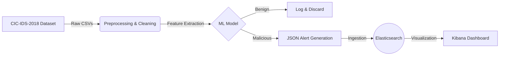

# Unified Network Threat Detection System
### Real-Time Multiclass Classification using ELK Stack & CSE-CIC-IDS2018

## Project Overview
This project implements an end-to-end **Intrusion Detection System (IDS)** designed to analyze encrypted network traffic in real-time. Unlike traditional signature-based firewalls, this system utilizes **Machine Learning (Random Forest/XGBoost)** to classify traffic patterns based on behavioral flow statistics.

The system ingests raw network flows, extracts features, performs multiclass classification across **7 distinct attack families**, and indexes the results into an **ELK Stack (Elasticsearch, Logstash, Kibana)** for live threat monitoring.

---

## Key Capabilities

* **Unified Multiclass Detection:** A single model capable of distinguishing between:
    * Brute Force (FTP, SSH)
    * DoS & DDoS (Hulk, Slowloris, LOIC)
    * Botnets
    * Web Attacks (SQL Injection, XSS)
    * Infiltration Attempts
    * Benign Traffic
* **Encrypted Traffic Analysis:** Relies on statistical features (Flow Duration, Packet Variance, Inter-arrival Time) rather than payload inspection, making it effective against encrypted streams.
* **ELK Stack Integration:** seamless pipeline exporting JSON predictions directly to Elasticsearch for visualization.
* **Operating Boundary (Closed-Set):** Statistically insignificant classes (e.g., Heartbleed, <0.01%) are excluded to prevent overfitting.

---

## Quick Start Guide

Clone the repository:

* git clone https://github.com/your-org/your-repo.git
* cd your-repo

Open the Colab notebook:

* Upload or open model_training.ipynb in Google Colab.

Install required dependencies:

* !pip install shap elasticsearch pandas numpy scikit-learn xgboost

* Run the preprocessing, feature selection, model training, SHAP explainability, and evaluation steps inside Colab.

Export results to Elasticsearch:

* python src/export_to_elasticsearch.py

* Open Kibana to view the dashboard and visualizations.

---

## Team Members

- Sarah Steadham  
- Juliana Garza  

---

## Documentation

The complete documentation is available in the GitHub Wiki.  
Pages include:

- Environment Setup  
- Dataset Overview  
- Preprocessing and Feature Engineering  
- Model Development  
- Elasticsearch Integration  
- Kibana Dashboard Guide

The Wiki contains all detailed instructions, diagrams, walkthroughs, and design decisions.

---

## Final Deliverables

- Clean data preprocessing and feature pipeline  
- Trained model and evaluation metrics   
- Elasticsearch indexed predictions
- .py scripts  
- Kibana dashboard  
- Final written report  
- Fully documented project repository  

---

## MIT License

Educational project for CIS 3370: Intrusion Detection Systems.  

